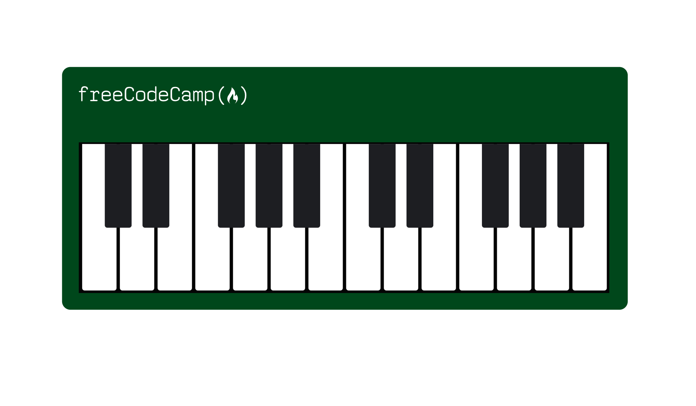

# Learning Responsive Web Design by Building a Piano.

**Screenshot**

<figure class="image">

**Languages used**

-   HTML
-   CSS

**What I Learned**

-   Using CSS and responsive design to code a piano.
-   Media queries and pseudo selectors.
